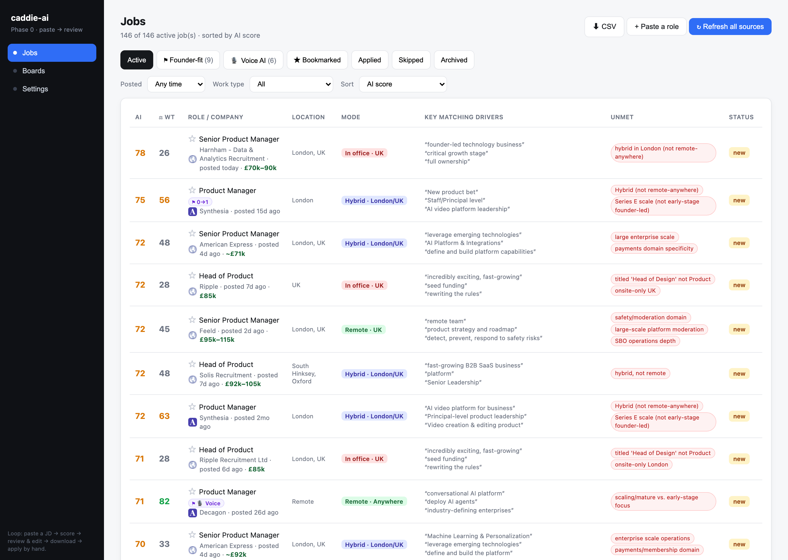
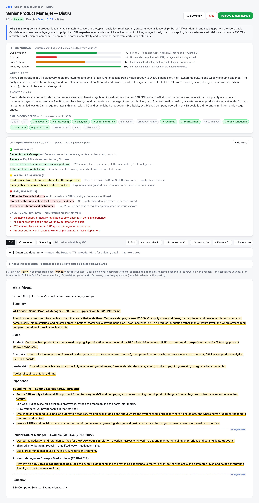

# caddie-ai

**Stop rewriting your CV for every job.** caddie-ai scans the market, scores each role
against *your* CV, and hands you a tailored CV, cover letter, and screening answers. You
review, tweak, and send. It never submits a thing on its own.

The twist: it **learns your voice**. Every edit you make trains the next draft, so the
corrections shrink with each application. And it all runs on your machine — your CV, your
history, and your API key never leave it.

> Like a golf caddie: it reads the course and hands you the right club. You take every swing.

## Screenshots

**Scored board with filters** — every role ranked 0–100 against your CV, with the key
matching drivers it quoted, unmet requirements, work-mode, and Founder-fit / Voice-AI lenses.



**Review: assessed JD + pre-drafted CV** — the JD's requirements classified
match / stretch / gap against your CV, a fit breakdown, then your CV tailored to the role
with every change highlighted (hover any mark to see the original + rationale) and ready to edit.



> Screenshots use **sample data** — a demo profile (“Alex Rivera”) scored against live public
> job listings. No real candidate data.

---

## Contents

- [Screenshots](#screenshots) · [Why](#why) · [The system at a glance](#the-system-at-a-glance)
- [The learning loop](#the-learning-loop-the-system-improves-every-time-you-edit) — the part that compounds
- [How fit is evaluated (JD ↔ your CV)](#how-fit-is-evaluated-jd--your-cv)
- [How it sources jobs](#how-it-sources-jobs) · [How drafting works](#how-drafting-works)
- [Architecture](#architecture) · [Setup](#setup) · [Settings reference](#settings-reference)
- [Safety & privacy](#safety--privacy-by-design) · [Roadmap](#roadmap) · [Tech stack](#tech-stack)

## Why

Applying well is slow: read the JD, judge whether it's worth your time, then rewrite your
CV and cover letter to match — for every single role. caddie-ai automates the *judgement
and the first draft*, where an LLM genuinely helps, and keeps the human firmly in the loop
for everything that carries risk (what you send, where you send it).

It runs entirely on your machine. Your CV, your application history, and your API key never
leave it.

## The system at a glance

caddie-ai is a **closed loop**, not a one-shot generator. Four engines feed each other, and
the output of your own judgement is captured and fed back in:

```
        ┌──────────── you skip / accept / edit ───────────┐
        │                                                 │
        ▼                                                 │
   ┌─────────┐    ┌──────────┐    ┌──────────┐    ┌───────┴────────┐
   │ SOURCE  │ ─► │  SCORE   │ ─► │  DRAFT   │ ─► │  REVIEW & SUBMIT │
   │ tiered  │    │ fit vs   │    │ tailored │    │  (you, manually) │
   │ boards  │    │ your CV  │    │ CV/CL/Q  │    └────────┬────────┘
   └─────────┘    └────┬─────┘    └────▲─────┘             │
                       │ matched/      │ learned rules,    │
                       │ unmet reqs    │ examples, anchors  │
                       ▼               │                    ▼
                 ┌─────────────────────┴───────────────────────┐
                 │  LEARNING LAYER  (style.md · skips · strengths)│
                 │  your edits + reasons → distilled → next draft │
                 └────────────────────────────────────────────────┘
```

The interesting design decisions live in three places: **how it sources** (a tiered spread
bounded by a recency horizon), **how it evaluates fit** (semantic JD↔CV reasoning, not
keyword matching), and — most importantly — **how it learns from you** (every edit you make
is captured, distilled, and folded into the next draft). The learning layer is what turns a
generic drafting tool into one that sounds like *you* after a dozen applications.

---

## The learning loop (the system improves every time you edit)

This is the heart of caddie-ai. The tool's first drafts are decent; its tenth drafts are
*yours*, because every correction you make is captured as a reusable preference and fed back
into future drafting and scoring. **Nothing here ever auto-edits your base CV** — the loop
only ever influences *future drafts* through files you control.

**1 · Capture — three feedback channels, all human-initiated**

| Channel | Trigger | Where it's stored | What it becomes |
|---|---|---|---|
| **Accepted edits** | You edit a drafted CV bullet or CL paragraph in the compare modal | `data/style.md` (append-only log of *AI-suggested → changed-to → your reason*) | Voice & wording preferences |
| **Bulk CL revision** | You paste a fully rewritten cover letter | the draft is paragraph-diffed; the model *infers a concise reason* per change for you to confirm, then appends to `style.md` | Same, captured in bulk |
| **Skips** | You pass on a role and give a reason | `data/skips.md` | **Negative anchors** — down-rank similar roles |
| **Strengths** | You list things you're strong at | `data/strengths.md` | **Positive anchors** — always treated as *met* |

**2 · Distil — raw log → compact, reusable knowledge**

A rebuild step (`engine/learndistill.py`) turns the raw `style.md` log into two distilled
layers, *without ever modifying the raw log*:
- **`style-rules.md`** — the model reads every captured *edit + reason* and distils a tight,
  de-duplicated do/don't rule set in your own voice (grouped VOICE & TONE / HARD DON'TS / CV
  / COVER LETTER). Duplicates merge; company-specific noise is dropped.
- **`style-examples.md`** — accepted edits grouped *per application*, so the drafter can
  sample a **balanced** set of examples rather than over-fitting to one company.

This re-distillation runs **automatically right before each generation** — but *only* when
you've added edits since the rules were last built (a cheap timestamp check). So every draft
reflects your latest corrections without re-distilling on every click, and **without a
schedule** — a fixed cadence would risk drafting from an obsolete rule set. You can also
trigger a rebuild manually any time.

**3 · Reinforce — fold it into the next generation**

On every draft, single-passage rewrite, and screening answer, caddie-ai assembles a
*learning block* (`draft._learning_block`) and prepends it to the model's system prompt:

> distilled **rules** (followed strictly) + a **balanced** set of accepted-edit examples
> (≤2 per company) + the **freshest** raw edits + your **strengths**.

Skips feed the scorer as negative anchors; strengths feed both the scorer and the drafter as
positive anchors. The result: the more you use it, the more its drafts pre-empt the edits
you'd have made — and the fewer corrections each new application needs.

### How your applications tune your CV and cover letter

The same loop is what lets *applying* shape your documents over time:

- A cover letter has a **fixed backbone** in a proven voice with `[BRACKETED]` slots; the
  drafter is told to treat it as *near-sacred*, fill only the slots, and **never invent** a
  fact to fill one — it leaves a visible `[ tell me … ]` placeholder instead.
- Every change you accept teaches a durable preference (e.g. "no em-dashes", "0→1 *launcher*,
  not *serial founder*", "outcomes not responsibilities"), which the next draft obeys.
- Because the learning lives in *your* files and only ever guides *future* drafts, your base
  CV/CL stay pristine and under your control — the tool tunes the **drafting behaviour**, not
  your source documents.

> **Design note:** the learning files are *yours*. caddie-ai appends to the raw log and
> regenerates the distilled layers, but treats your curated rules as authoritative — it
> never silently overwrites what you've hand-edited.

---

## How fit is evaluated (JD ↔ your CV)

Scoring reasons over your CV + summary semantically — *not* literal keyword overlap (a deep
0→1 AI builder scores high on "Qualifications" even if the JD never uses those words). It
runs at two depths plus an on-demand requirement check:

**1 · Fast ranking (every role).** A cheap, batched pass (default `claude-haiku-4-5`, 10
jobs/call, with the candidate profile **prompt-cached** so repeat runs are near-free) returns
for each role: a **0–100 fit score**, a one-line reason, up to three **verbatim "drivers"**
quoted from the JD, an inferred location, and up to three **unmet** requirement tags. A
transparent **weighted score** (remote / skills / domain / stage, weights you control) runs
alongside as a cross-check — and as the **no-API fallback** so the app still ranks without a key.

**2 · Deep analysis (on demand, per role).** Opens a fuller picture: a *score rationale*,
*best-fit* and *shortcomings* paragraphs, the profile **skills it matched**, the **unmet**
requirements (strictly JD→candidate: things the JD *asks for* that your CV lacks), and a
four-dimension **breakdown** (Qualifications · Domain · Role & stage · Remote/location), each
scored 0–100 with a one-line note.

**3 · Requirement-by-requirement check.** `classify_requirements` extracts 5–15 **verbatim**
requirement phrases from the JD and tags each **match / stretch / mismatch** — quoted exactly
so the UI can highlight them in place. This is the quick "do I actually clear the bar?" read.

**The link to drafting:** the matched strengths and honest gaps from scoring are passed
directly into the draft prompt (`role_fit_block`) — matched strengths get surfaced in the
CV and leaned on in the letter; the most relevant gap is addressed candidly in the cover
letter's gap paragraph and bridged with your closest true experience. Never hidden, never faked.

Guards throughout: the scorer is told to **spread** scores (no clustering), to quote the JD
rather than paraphrase, and to **never invent** a requirement the JD doesn't state.

---

## How it sources jobs

The interesting part isn't any one fetch — it's the **spread**. caddie-ai reaches the
market three complementary ways, each behind one normalised `Job` shape so scoring and
drafting don't care where a role came from:

- **Global aggregator boards — via API.** Public/official feeds (e.g. RemoteOK, Working Nomads, Adzuna, Web3 Career) queried straight through their APIs. Broad reach, cheap, robust.
- **Targeted niche portals — via allowed, filtered web indexing.** For boards without an API, a rate-limited Playwright tier renders the board's *own* filtered search and indexes **only the matching rows**. It never crawls a full site — it rides the board's filters rather than scraping everything.
- **Direct-employer companies — via their ATS.** Company career pages on Greenhouse / Lever / Ashby / Workable / Recruitee / SmartRecruiters / Personio are read through the ATS's no-key endpoints, so you track specific companies you care about, not just aggregators.

(Plus the simplest path: paste a single job URL and it normalises that one role.)

### Depth of search = a recency horizon, not a fixed page count

caddie-ai doesn't fetch "the last N pages" or "100 newest rows" and call it done. Each
source is bounded by a **time horizon** (`recency_days`, default **7**), and it's **incremental per source**:

- **First scan of a source** → it auto-pulls the full backlog inside the horizon (everything posted in the last 7 days).
- **Every refresh after that** → it only pulls what's *new since that source's own last scan* — tracked per board, so a busy board and a quiet one each advance independently.

The result is comprehensive first-time coverage without re-ingesting the same roles on
every run, and the window is a single config value you can widen or narrow.

## How drafting works

For a role worth pursuing, the drafter tailors your base CV + cover letter and answers
screening questions in one pass:

- **Per-gig base-CV routing.** You keep several base CVs, each flagged for a kind of role
  (e.g. **Founder**, **EIR / founder-welcome**, **Web3 / Blockchain**, **Voice AI**, **0→1
  build**). Before tailoring, the drafter auto-picks the closest-fit base from the job's
  detected flags (`_suggest_app_cv`) — so a Web3 role and an enterprise role *start from
  different foundations*, not one compromise CV. You can override the pick per draft, and
  it falls back to your single matching CV when no variants exist. (B2B vs B2C is handled as
  a draft-time **emphasis** you nudge per application, not a separate base.)
- **Provenance on every change.** Each edited span is emitted as
  `<mark class="chg" data-base="ORIGINAL" data-rat="why">new text</mark>`, so the review UI
  shows an inline diff and a side-by-side compare modal — you see exactly what changed and why.
- **Screening answers.** If the live application form's questions are supplied, it answers
  *those* exactly and weaves the relevant themes into the letter subtly; otherwise it infers
  the likely ones ("Why this company?", salary, notice).
- **No-invention guardrails.** Never fabricates employers, dates, metrics, or a "why-excited"
  detail; unknown facts become a visible `[ tell me … ]` placeholder for you to fill.
- **Graceful degradation.** No API key or a failed call falls back to rendering your base
  documents untailored, so the UI always works.
- **House-style enforcement in code**, not just prompt: e.g. em-dashes are stripped from prose
  and your standard CV page breaks are inserted automatically.

---

## Architecture

A small, dependency-light Python codebase — plain modules over frameworks.

```
adapters/   board fetchers, organised by reliability tier:
              api      — public JSON feeds & no-key ATSs (Greenhouse/Lever/Ashby/…)
              listing  — fast static HTML
              browser  — Playwright, rate-limited, indexes only matching rows
engine/     fetch (URL→JD) · score + fitscore (weighted + AI fit, requirement check)
            · draft (tailoring + provenance) · learndistill (the learning loop)
            · clchanges (bulk CL diff→reasons) · questions (screening) · pipeline
            · store (one normalised Job shape + all persistence) · models (pydantic)
ui/         FastAPI backend + a static single-page UI
cv/         base-cv.md, base-cl.md  (your source documents)
data/       boards.yaml · profile.yaml (criteria + weights) · applications.csv (tracker)
            · style.md / style-rules.md / style-examples.md (the learning layer)
            · skips.md (negative anchors) · strengths.md (positive anchors)
docs/       UX design specs (v1→v4)
```

**Design principles**
- **One normalised `Job` shape** across every adapter, validated with `pydantic` — scoring and drafting are decoupled from where a role came from.
- **Tiered fetching** — build and trust the cheap, robust API tier before the fragile browser tier; the browser tier applies the board's *own* filters and never crawls full sites.
- **Config over code** — scoring weights, rubric, filters, and board queries live in `profile.yaml`/`boards.yaml` (and the Settings UI), never hardcoded; editing them re-scores everything.
- **Auditable everything** — drafts keep change provenance; the learning layer keeps the raw log separate from the distilled rules so you can always see *why* the tool behaves as it does.
- **Human-in-the-loop by construction** — the loop is closed by *your* review, not by an auto-submit.

## Setup

**Prerequisites:** Python 3.11+ (3.9+ works), an [Anthropic API key](https://console.anthropic.com)
(for AI scoring & drafting), macOS/Linux, ~300 MB free (Playwright downloads a headless browser).

```bash
git clone https://github.com/DM4419/caddie-ai && cd caddie-ai
cp .env.example .env          # then add your Anthropic API key
./run.sh                      # first run sets up venv + deps + browser, then opens the app
```

`run.sh` creates the virtualenv, installs dependencies, installs the Playwright browser, and
opens **http://127.0.0.1:8000**. Later runs just start the server.

<details><summary>Manual setup (instead of run.sh)</summary>

```bash
python3 -m venv .venv && source .venv/bin/activate
pip install -r requirements.txt
python -m playwright install chromium      # for the browser-tier boards
echo "ANTHROPIC_API_KEY=sk-ant-..." > .env
uvicorn ui.app:app --port 8000
```
</details>

> The repo ships a **sample** CV, cover-letter backbone, and profile so it runs out of the
> box. Replace them with your own (Settings tab, or edit `cv/` and `data/profile.yaml`) to
> make scoring and drafting meaningful. The app runs without an API key too — it just shows
> the weighted score and untailored base documents until you add one.

Running into trouble (connection refused, a board that won't scan, Playwright errors)?
See the troubleshooting table in **[SETUP.md](SETUP.md)**.

## Settings reference

Everything below is editable in the UI's **Settings** tab (and persisted to `data/profile.yaml`).

| Setting | What it controls | Notes |
|---|---|---|
| **Base documents** | Your CV + cover-letter backbone (`.md`/`.txt`) | Used to score *and* draft. The CL backbone uses `[BRACKETED]` slots. **Required** for meaningful output. |
| **AI fit rubric** (`fit_rubric`) | The **primary** scorer — plain-English rules the model follows to rank 0–100 (tiers, domains, deal-breakers) | Saving re-scores everything. This is where most of your judgement lives. |
| **Candidate summary** (`candidate_summary`) | A LinkedIn-style paragraph the scorer reasons against alongside your CV | Edit in `profile.yaml`. |
| **Weighted factors** (`weights`) | The secondary, transparent score and the **no-AI fallback**: per-factor weights **summing to 100** (remote / skills / domain / stage) + the keyword lists (`domains`, `skills`, `stage_signals`, `roles`) each factor matches | Hand-tunable; never hardcoded. |
| **Board search queries** (`role_queries`) | The job titles query-based boards search for | A shared default plus optional per-board overrides. |
| **Filters** | `geo_gate` (which work modes/regions to keep — US options off by default), spoken `languages` (+ boost/block rules), `recency_days` (the search horizon) | Rows outside the geo gate are dropped before storage. |
| **Boards** (`boards.yaml`) | The source registry: API / listing / browser / ATS entries, each enable-able | Add company ATS boards by slug; no key needed for Greenhouse/Lever/Ashby/etc. |
| **Skips / Strengths** | The learning anchors (see [the learning loop](#the-learning-loop-the-system-improves-every-time-you-edit)) | Captured as you use the app; editable as plain markdown. |

**Optional keys in `.env`** (only for specific boards / model overrides):

```bash
ANTHROPIC_API_KEY=sk-ant-...           # required for AI scoring & drafting
# ANTHROPIC_MODEL=claude-sonnet-4-6    # drafting model (default)
# FIT_MODEL=claude-haiku-4-5           # fast/cheap fit scorer (default)
# ADZUNA_APP_ID=...  ADZUNA_APP_KEY=...   # free: https://developer.adzuna.com
# WEB3_CAREER_TOKEN=...                # https://web3.career/web3-jobs-api
```

## Safety & privacy by design

- **No auto-submit, ever.** The agent drafts and fills; you submit. (Avoids ToS/ban risk.)
- **Human-in-the-loop.** Nothing is finalised without your review.
- **Local-first.** Runs on `localhost`; no web host, no telemetry.
- **Secrets stay in `.env`** (gitignored), never in code. The repo ships only `.env.example`.
- **The browser tier never crawls full sites** — it only ever rides a board's own filters.
- **Your learning files are yours** — the tool appends and distils, but never silently overwrites your curated rules, and never edits your base CV.

## Roadmap

The core system — source → score → draft → **learn** — is in place and closed, including
per-gig base-CV routing and re-distillation before each generation. What's intentionally
*not* built yet:

- **Notifications for hands-off scans** — a ping when a high-fit role lands. Kept optional and
  outside the fetch path by design (fetching stays in Python, never a third-party automation).
- **Wider board coverage** — more direct-employer ATS adapters and niche portals.
- **PDF layout fidelity** — richer export templates matching a human-formatted master.

*Deliberately rejected:* a fixed **schedule** for re-distilling the learning rules — drafts
should always reflect your latest edits, so re-distillation is triggered by change (before a
generation), never by a clock that could draft from an obsolete rule set.

## Tech stack

Python 3.11+ · FastAPI · pydantic · httpx · BeautifulSoup · Playwright · the Anthropic API
(Sonnet for drafting, Haiku for fast scoring, with prompt caching).

## Status

A working personal project, built phase by phase (see `claude-code-runbook.md` and
`CLAUDE.md` for the build plan and conventions). Shared as a portfolio piece — the public
copy contains sample data only; no real application history or credentials.

## License

[MIT](LICENSE)
