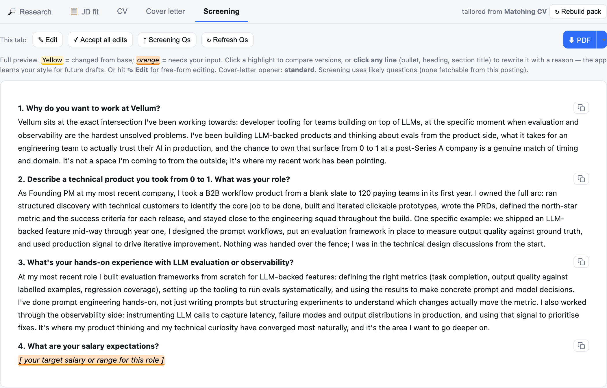

<p align="center">
  
</p>

<p align="center"><em>An open-source co-pilot for your job search — it sources roles, scores them against your CV, drafts tailored applications, and learns from your edits. Runs entirely on your machine.</em></p>

---

# caddie-ai

Applying to a lot of roles gets repetitive: read the posting, decide if it's worth it, then
retailor your CV and cover letter. caddie-ai takes the first pass — it scans job boards, scores
how well each role fits your CV, and drafts a tailored CV, cover letter, and screening answers.
You review, edit, and send everything yourself; **it never submits anything on its own.**

It runs entirely on your machine and **learns from the edits you make**, so over time its drafts
land closer to your voice.

> The name: like a golf caddie, it reads the course and hands you the right club. You still take
> every swing.

## The loop

A **closed loop**, not a one-shot generator — each stage feeds the next, and your own judgement
is captured and fed back in:

```
   ┌─────────── you skip / accept / edit / apply ───────────┐
   │                                                        │
   ▼                                                        │
┌────────┐  ┌────────┐  ┌──────────────────────────────┐  ┌─┴──────────────┐
│ SOURCE │─►│ SCORE  │─►│   BUILD APPLICATION PACK      │─►│ REVIEW & SUBMIT │
│ many   │  │ fit vs │  │ resolve real ATS → questions  │  │ (you, manually) │
│ boards │  │ your CV│  │ → research → CV / CL / answers │  └───────┬────────┘
└────────┘  └────────┘  └──────────────────────────────┘          │
        ▲                                                          │
        └──────── LEARNING LAYER (style · skips · strengths) ◄──────┘
```

Plus a chat-based **CV Builder** (`/cv-builder`) that interviews you — or assesses a CV you
upload — and produces a clean, ATS-friendly one-page CV.




> Screenshots use **sample data** — a demo profile ("Alex Rivera") and example roles.

## Highlights

- **Broad, tiered sourcing** — free remote APIs, direct ATS boards (Greenhouse / Lever / Ashby /
  Workable / Personio / Recruitee / SmartRecruiters / Teamtailor), aggregators (Adzuna, TheirStack,
  Google Jobs), and **VC portfolio talent networks** — all behind one normalized `Job` shape.
- **Fit scoring that's honest** — a semantic 0–100 score vs your CV plus a transparent weighted
  cross-check. **Location/timezone is a hard gate, not a score** (configurable band).
- **Tailored packs, with guardrails** — CV, cover letter, and screening answers from one
  research-first framing, with change provenance and a strict **no-invention** rule.
- **Editable drafting doctrines** — the voice/structure rules for the cover letter, CV summary,
  and screening answers live in plain files you can edit in Settings (prompt-cached).
- **Strengthen your match** — every JD requirement is mapped to a CV-grounded bullet you accept or
  rewrite, with the CV experience it belongs under and a cover-letter toggle.
- **Reaches the real apply page** — follows an aggregator link to the underlying ATS to detect it
  and fetch the live screening questions.
- **A learning loop that compounds** — your edits + reasons distil into rules that shape the next draft.

## How it works

Each part has a deliberate design choice behind it — the details live in their own docs:

- **[Sourcing jobs](docs/how-it-works/sourcing.md)** — fetch tiers (API · aggregator · browser ·
  direct ATS) behind one `Job` shape; incremental fetching; coverage bounded by a recency horizon.
- **[Fit scoring](docs/how-it-works/scoring.md)** — semantic 0–100 fit, a weighted cross-check, and a
  verbatim requirement check. Location/timezone is a gate, not a score.
- **[Drafting the pack](docs/how-it-works/drafting.md)** — research-first framing → editable
  doctrines → CV / cover letter / answers, with provenance, strengthen-your-match, and no-invention guardrails.
- **[Board / ATS optimisation](docs/how-it-works/board-optimization.md)** — tunes the pack to how
  Greenhouse / Lever / Ashby actually screen.
- **[The learning loop](docs/how-it-works/learning-loop.md)** — your edits + reasons → distilled
  rules → the next draft. The part that compounds.
- **[CV Builder](docs/how-it-works/cv-builder.md)** — conversational, import-and-assess →
  structured data → deterministic template → PDF.
- **[Architecture](docs/how-it-works/architecture.md)** · **[Settings reference](docs/settings.md)**

## Quick start

```bash
git clone https://github.com/DM4419/caddie-ai && cd caddie-ai
cp .env.example .env          # then add your Anthropic API key
./run.sh                      # sets up venv + deps + browser, then opens the app
```

Opens **http://127.0.0.1:8000**. The repo ships a **sample** CV and profile so it runs out of the
box — replace them with your own (Settings tab) to make it meaningful. Optional board keys
(aggregators) are in `.env.example`. Full install + troubleshooting: **[SETUP.md](SETUP.md)**.

## Safety & privacy

- **No auto-submit, ever** — the agent drafts and fills; you submit.
- **Local-first** — runs on `localhost`; no web host, no telemetry. Your CV, history, and keys
  never leave your machine.
- **Secrets stay in `.env`** (gitignored); the repo ships only `.env.example`.
- **The browser tier never crawls full sites** — it only rides a board's own filters.
- **Your learning files are yours** — the tool appends and distils, but never silently overwrites
  your curated rules or edits your base CV.

## Tech stack

Python 3.11+ · FastAPI · pydantic · httpx · BeautifulSoup · Playwright · the Anthropic API
(Sonnet for drafting & scoring, with prompt caching on the static doctrine).

Shared as a portfolio piece — this public copy contains **sample data only**, no real application
history or credentials.

## License

[MIT](LICENSE)
